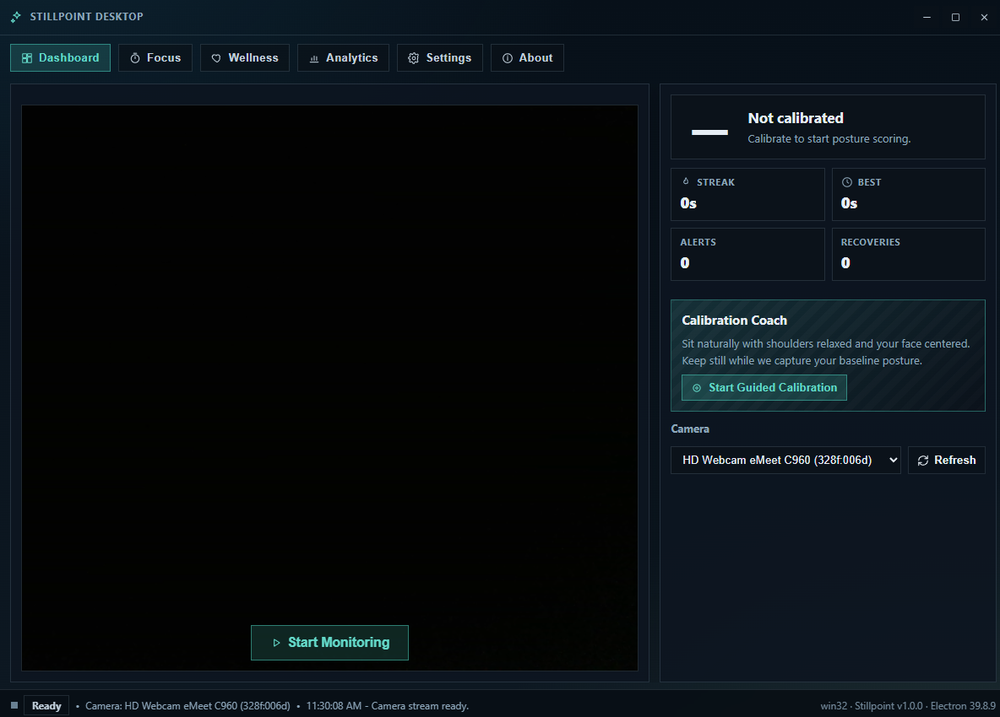
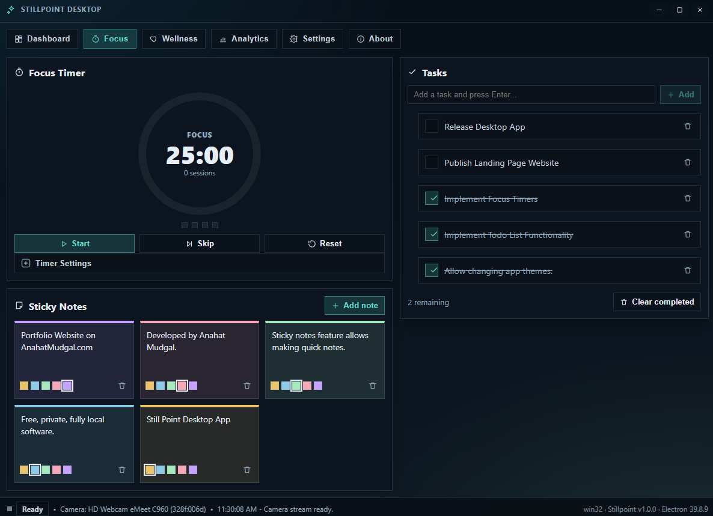
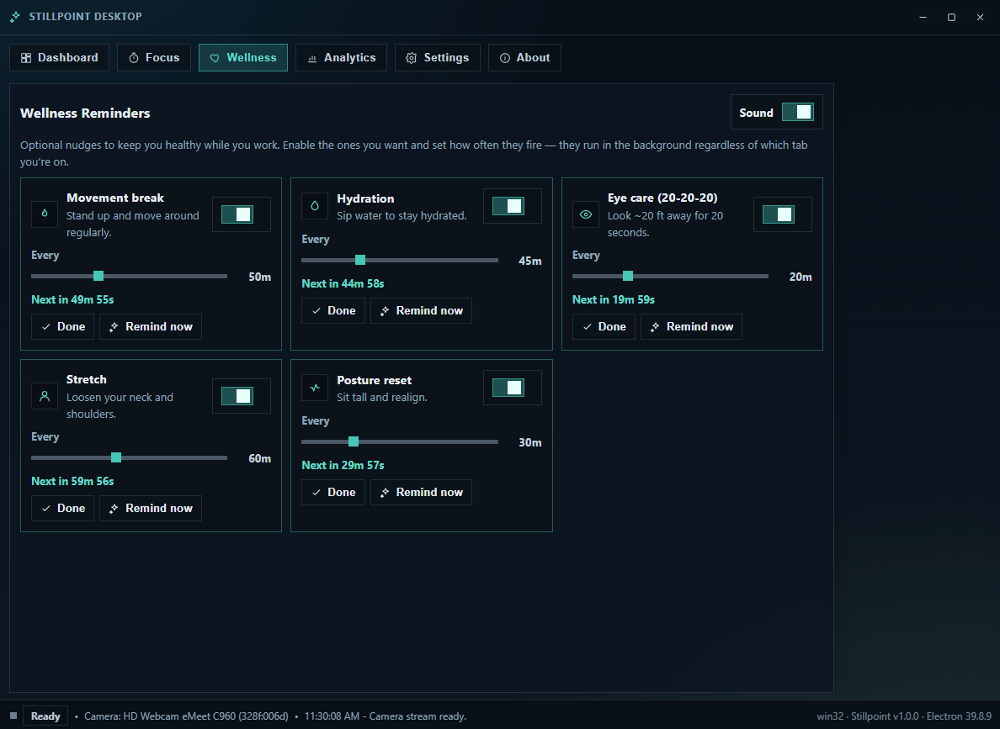
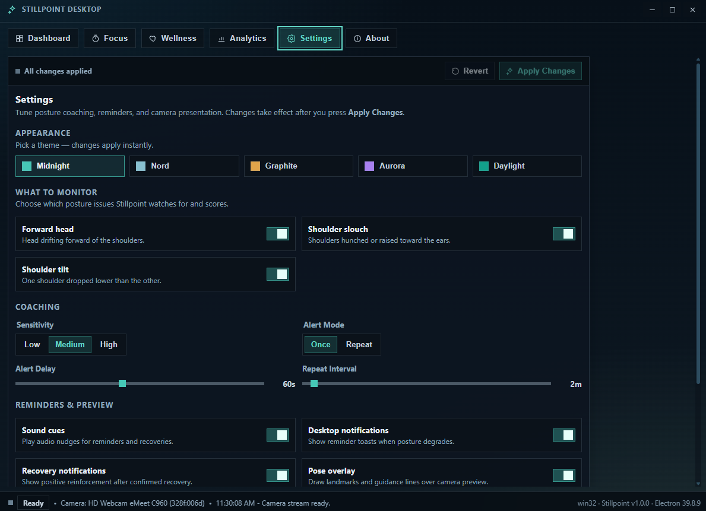

<div align="center">

# Stillpoint — Landing Page

**The marketing site for [Stillpoint](https://github.com/AnahatM/Stillpoint) — a local-first desktop app that coaches your posture in real time, with nothing ever leaving your device.**

[](https://vite.dev)
[](https://react.dev)
[](https://www.typescriptlang.org)
[](https://tailwindcss.com)
[](#license)
[](https://anahatmudgal.com)
[](https://github.com/anahatm)

[](REPLACE_WITH_SITE_URL)
[](https://github.com/AnahatM/Stillpoint/releases)

</div>

---

## About

This repository is the **marketing website** for Stillpoint — a single-page static site whose only job is to explain the app and send visitors to the right download. It has no backend and builds to plain static files you can host anywhere.

The design leans into Stillpoint's identity: a dark "calibration instrument" aesthetic with deep navy surfaces, a teal accent, sharp corners, viewfinder framing that echoes the webcam/pose theme, and pointer-reactive touches — a cursor-following glow and a glowing ASCII field. It's fully responsive, accessible, SEO-ready, and animated entirely with CSS plus a tiny `IntersectionObserver` reveal hook — no animation libraries.


## Screenshots

> These are screenshots of the **Stillpoint desktop app** that the site showcases. Drop new captures in `public/screenshots/`.

|  |  |
| :-----------------------------------------------------------------------------------------------: | :-----------------------------------------------------------------------------: |
|              |           |

## Key Features

- **Local-first design language** — a dark, teal-accented "calibration instrument" theme with sharp corners and viewfinder framing pulled straight from the app's identity.
- **Animated, reactive hero** — a framed dashboard mockup with floating posture-score and streak readouts, over a cursor-following glow and a glowing, pointer-reactive ASCII field.
- **Posture spotlight** — an illustrative live-monitor mock with an animated 0–100 score gauge, a contained scan line, and per-issue detection toggles.
- **Zigzag feature showcase** — Focus, Wellness, Analytics and customization presented as angled, depth-stacked screenshots that straighten and lift on hover.
- **Prominent privacy story** — a dedicated section making the on-device, zero-upload guarantee the centerpiece, reinforced by an open-source "inspect the code" callout.
- **Built for shipping** — fully responsive, accessible (skip link, semantic landmarks, keyboard-friendly FAQ, visible focus rings, `prefers-reduced-motion`), and SEO-ready (title, meta description, Open Graph & Twitter cards, SVG favicon).

## Getting Started

> Requires **Node.js 18+** (Node 20+ recommended).

```bash
npm install      # install dependencies
npm run dev      # start the dev server (http://localhost:5173)
npm run build    # type-check and build static files to /dist
npm run preview  # preview the production build locally
npm run lint     # run ESLint
```

## Project Structure

```
.
├─ public/
│  ├─ favicon.svg            # Stillpoint mark (viewfinder + still-point node)
│  └─ screenshots/           # ← real app screenshots live here
├─ src/
│  ├─ components/
│  │  ├─ Header.tsx          # sticky nav + mobile menu
│  │  ├─ Hero.tsx            # headline, CTAs, trust chips, reactive mockup
│  │  ├─ PostureSpotlight.tsx   # primary feature (posture monitoring)
│  │  ├─ Features.tsx        # zigzag showcase: focus / wellness / analytics / customization
│  │  ├─ HowItWorks.tsx      # 3-step explainer
│  │  ├─ Privacy.tsx         # local-first / privacy section
│  │  ├─ Download.tsx        # platform cards + requirements + signing note
│  │  ├─ FAQ.tsx             # accessible accordion
│  │  ├─ OpenSource.tsx      # open-source callout + about the developer
│  │  ├─ Footer.tsx
│  │  ├─ icons/              # inline SVG icon set
│  │  └─ ui/                 # Logo, buttons, ScreenshotFrame, overlays, backdrops
│  ├─ hooks/
│  │  ├─ useReveal.ts        # scroll-reveal via IntersectionObserver
│  │  └─ usePointerGlow.ts   # pointer → CSS vars (cursor glow / ASCII field)
│  ├─ lib/site.ts            # ← all editable links & config live here
│  ├─ index.css              # design tokens (Tailwind v4 @theme) + utilities
│  └─ App.tsx                # page composition
└─ index.html                # SEO / meta / fonts
```

## Author

**Anahat Mudgal**

- Website: [anahatmudgal.com](https://anahatmudgal.com)
- GitHub: [@AnahatM](https://github.com/anahatm)

## License

This project is open source and available under the MIT License.

---

<div align="center">
<sub>Local and Open-Source · Stillpoint</sub>
</div>
